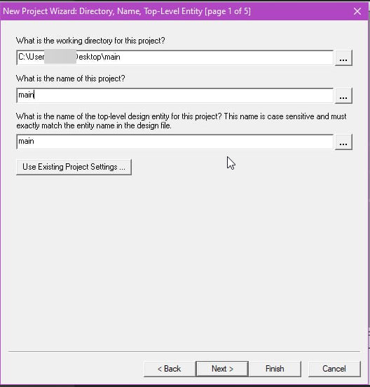

 <font size="10">encVHDL</font>

​ 15<sup>th</sup> April 2023

​ Challenge Author(s): [mohnad0B](https://app.hackthebox.com/profile/505576)

### Description:

I build a simple circuit to encrypt my secret message. Can you find the secret message?
length of the xorKey is 4 bytes

### Objective

learn some VHDL basics \
learn how to use VHDL to build a simple circuit \
write a python script to simulate the decoder gate \
basic knowledge of xor \
basic knowledge of logic gates

### Difficulty:

`easy`

### Flag:

`HTB{I_L0v3_VHDL_but_LOve_my_5w33thear7_m0re}`

# Challenge

[encVHDL.zip](https://files.fm/u/6x2p8efbf)

# Solver

The first step is to understand the VHDL code \
we have two components: \
**xor_get**

```vhdl
library ieee;
use ieee.std_logic_1164.all;

entity xor_get is
    port(input1,input2 : in std_logic_vector(15 downto 0);
        output : out std_logic_vector(15 downto 0));
    end xor_get;

architecture Behavioral of xor_get is
begin
    output <= input1 xor input2;
end Behavioral;
```

is simple xor gate \
**decoder_4x16**

```vhdl
library ieee;
use ieee.std_logic_1164.all;

entity decoder_4x16 is
    port(input : in std_logic_vector(3 downto 0);
        output : out std_logic_vector(15 downto 0));
    end decoder_4x16;

architecture Behavioral of decoder_4x16 is
begin
    process(input)
    begin
        case input is
            when "0000" => output <= "0000000000000001";
            when "0001" => output <= "0000000000000010";
            when "0010" => output <= "0000000000000100";
            when "0011" => output <= "0000000000001000";
            when "0100" => output <= "0000000000010000";
            when "0101" => output <= "0000000000100000";
            when "0110" => output <= "0000000001000000";
            when "0111" => output <= "0000000010000000";
            when "1000" => output <= "0000000100000000";
            when "1001" => output <= "0000001000000000";
            when "1010" => output <= "0000010000000000";
            when "1011" => output <= "0000100000000000";
            when "1100" => output <= "0001000000000000";
            when "1101" => output <= "0010000000000000";
            when "1110" => output <= "0100000000000000";
            when "1111" => output <= "1000000000000000";
            when others => output <= "0000000000000000";
        end case;
    end process;
end Behavioral;
```

is a decoder gate with 4 inputs and 16 outputs


and we have a main component **encVHDL**

```vhdl
library ieee;
use ieee.std_logic_1164.all;

entity main is
    port(input_1,input_2 : in std_logic_vector(3 downto 0);
        xorKey : in std_logic_vector(15 downto 0);
        output1,output2 : out std_logic_vector(15 downto 0));
    end main;

architecture Behavioral of main is

    signal decoder1,decoder2: std_logic_vector(15 downto 0);
    component xor_get is
        port(input1,input2 : in std_logic_vector(15 downto 0);
            output : out std_logic_vector(15 downto 0));
        end component;
    component decoder_4x16 is
        port(input : in std_logic_vector(3 downto 0);
            output : out std_logic_vector(15 downto 0));
        end component;
            begin
                L0 : decoder_4x16 port map(input_1,decoder1);
                L1 : decoder_4x16 port map(input_2,decoder2);
                L2 : xor_get port map(decoder1,xorKey,output1);
                L3 : xor_get port map(decoder2,xorKey,output2);

        end Behavioral;
```

We have show the circuit in a simulation such as Quartus II

1- New Project


2- Now we need to get the same name with the main entity



3- Next, Next, finish

4- now click `new file` and add the VHDL code


5- right click on entity `Locate` >> `RTL Viewer`


6- now we can see the circuit


After understanding the VHDL code, we need to write a python script to simulate the decoder gate \

```python
def decoder(c):
    return '1' + (int(c,2))*'0'
```

And we need to see the output for all printable possible so

```python
from string import printable

keyd = {}

for i in printable:
    keyd[i] = [int(decoder(bin(ord(i))[2:].zfill(8)[:4]),2), int(decoder(bin(ord(i))[2:].zfill(8)[4:]),2)]

```

the flag start with `HTB{` so we need to find the first 4 bytes of the flag and the xorKey length is 4 bytes so we can find the xorKey

```python
print(chr(keyd['H'][0]^int(flag_enc[0].split()[0])), chr(keyd['H'][1]^int(flag_enc[0].split()[1])))
print(chr(keyd['T'][0]^int(flag_enc[1].split()[0])), chr(keyd['T'][1]^int(flag_enc[1].split()[1])))
print(chr(keyd['B'][0]^int(flag_enc[2].split()[0])), chr(keyd['B'][1]^int(flag_enc[2].split()[1])))
print(chr(keyd['{'][0]^int(flag_enc[3].split()[0])), chr(keyd['{'][1]^int(flag_enc[3].split()[1])))
```

output:

```
3 3
1 1
1 1
7 7
```

`xorKey = b'3117'`

now we can decrypt the flag and get the flag

```python

def decoder(c):
    return '1' + (int(c,2))*'0'

flag_enc = open('out.txt').read().splitlines()

from string import printable
keyd = {}


for i in printable:
    keyd[i] = [int(decoder(bin(ord(i))[2:].zfill(8)[:4]),2), int(decoder(bin(ord(i))[2:].zfill(8)[4:]),2)]

# print(chr(keyd['H'][0]^int(flag_enc[0].split()[0])), chr(keyd['H'][1]^int(flag_enc[0].split()[1])))
# print(chr(keyd['T'][0]^int(flag_enc[1].split()[0])), chr(keyd['T'][1]^int(flag_enc[1].split()[1])))
# print(chr(keyd['B'][0]^int(flag_enc[2].split()[0])), chr(keyd['B'][1]^int(flag_enc[2].split()[1])))
# print(chr(keyd['{'][0]^int(flag_enc[3].split()[0])), chr(keyd['{'][1]^int(flag_enc[3].split()[1])))

key = (chr(keyd['H'][0]^int(flag_enc[0].split()[0])) + chr(keyd['T'][0]^int(flag_enc[1].split()[0])) + chr(keyd['B'][0]^int(flag_enc[2].split()[0])) + chr(keyd['{'][0]^int(flag_enc[3].split()[0]))).encode()

for k,i in enumerate(flag_enc):
    for j in keyd:
        if keyd[j] == [(int(i.split()[0])^key[k%4]),(int(i.split()[1])^key[k%4])]:
            print(j, end='')
            break
```
